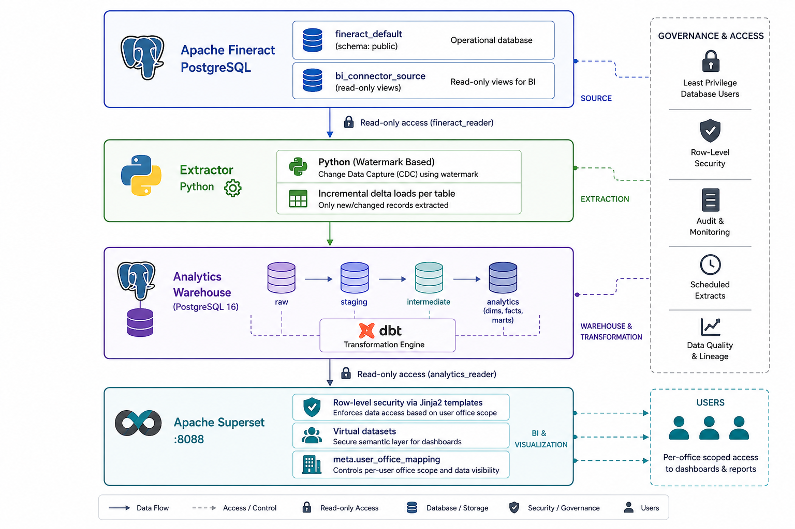

<!--
Licensed to the Apache Software Foundation (ASF) under one
or more contributor license agreements.  See the NOTICE file
distributed with this work for additional information
regarding copyright ownership.  The ASF licenses this file
to you under the Apache License, Version 2.0 (the
"License"); you may not use this file except in compliance
with the License.  You may obtain a copy of the License at

  http://www.apache.org/licenses/LICENSE-2.0

Unless required by applicable law or agreed to in writing,
software distributed under the License is distributed on an
"AS IS" BASIS, WITHOUT WARRANTIES OR CONDITIONS OF ANY
KIND, either express or implied.  See the License for the
specific language governing permissions and limitations
under the License.
-->

# Apache Fineract Business Intelligence

The analytics pipeline for [Apache Fineract](https://fineract.apache.org/): the open-source core banking platform for financial inclusion.

This project reads data from an Apache Fineract PostgreSQL database, transforms it through a layered dbt pipeline, and serves interactive dashboards in Apache Superset. It is **downstream and operationally isolated** from Fineract: the only coupling is a read-only credential on the Fineract database. Everything else, the analytics warehouse, dbt transformations, and dashboards runs independently.

---

## Documentation

| Document | Purpose |
|---|---|
| [docs/architecture.md](docs/architecture.md) | System topology, data flow, warehouse schemas, security model, design decisions |
| [docs/testing.md](docs/testing.md) | Running tests, linters, and license checks locally |
| [CONTRIBUTING.md](CONTRIBUTING.md) | Contribution workflow, branch/PR conventions, coding standards |
| [CODE_OF_CONDUCT.md](CODE_OF_CONDUCT.md) | Community standards and reporting |

---

## What This Project Provides

| Component | Directory | Description |
|---|---|---|
| **Extractor** | `extractor/` | Python service that pulls changed rows from Fineract using watermark-based incremental extraction |
| **Analytics Warehouse** | `warehouse/` | PostgreSQL 16 with `raw`, `staging`, `intermediate`, `analytics`, and `meta` schemas |
| **dbt Transformations** | `dbt/` | Staging views, dimensional models, daily snapshot facts, and presentation marts |
| **Apache Superset** | `docker/superset/` | Pre-bootstrapped dashboards with office-level row-level security (RLS) |
| **Pipeline Orchestration** | `scripts/` | Shell scripts that coordinate extraction → dbt build → Superset refresh |

---

## Pre-Built Dashboards

| Dashboard | Metrics |
|---|---|
| **Portfolio Health** | Gross Loan Portfolio, active borrowers, PAR 30+ ratio, NPA ratio, disbursement & collection trends, office and product breakdown |
| **Delinquency & PAR** | PAR buckets (30/60/90/NPA), delinquency trends over time, bucket migration analysis |
| **Repayment Behavior** | Repayment schedule adherence, early/late payment patterns |

---

## Architecture Overview




> For full pipeline flow, watermark extraction diagrams, warehouse schema breakdown, and security model detail, see **[docs/architecture.md](docs/architecture.md)**.

---

## Prerequisites

| Tool | Minimum Version | Notes |
|---|---|---|
| Docker Engine / Docker Desktop | 24.0 | Must be running |
| Docker Compose v2 plugin | 2.20 | Verify with `docker compose version` |
| Git | 2.x | |
| Bash | 3.2+ | Git Bash satisfies this on Windows |

No local Python, Java, or PostgreSQL installation is required to run the stack via Paths A or B below. Path C additionally requires a local JDK 21 and PowerShell.

---

## Quickstart

The steps below use Bash. On macOS or Linux run them in your shell directly. On Windows, run them inside Git Bash.

### 1. Choose a setup path for the Fineract source database

Every path below ends with a Postgres database holding Fineract-shaped `m_*` tables. Pick one:

| Path | What it does | Best for | Platform |
|---|---|---|---|
| **[A — Full Fineract](#path-a--full-fineract-application)** | Clones `apache/fineract`, runs its own Postgres container and the real Fineract application (Flyway creates every table) | Testing against real Fineract business logic; the most realistic setup | Any (Docker) |
| **[B — Schema only](#path-b--schema-only-fastest)** (fastest) | Uses this project's own `fineract-db` container and a hand-written schema + seed data — no Fineract application involved | Fastest way to get a working BI stack; **this is the path CI runs on every push** | Any (Docker) |
| **[C — Local Fineract dev server](#path-c--local-fineract-dev-server-windows-only)** | Uses this project's own `fineract-db` container, but runs the real Fineract application locally via Gradle (not Docker) | Iterating on Fineract itself while developing the BI pipeline | Windows only |

If you are not sure which to pick, use **Path B** — it is the fastest to set up and the one continuously verified in CI.

### 2. Clone and configure this project

```bash
git clone https://github.com/apache/fineract-business-intelligence.git
cd fineract-business-intelligence
cp .env.example .env
```

The defaults in `.env` work for local development without any changes, **except** for Path B, which additionally requires:

```bash
echo "SOURCE_DB_HOST=fineract-db" >> .env
echo "SOURCE_DB_HOST_PORT=5432" >> .env
```

This points the extractor at this project's own `fineract-db` service instead of the default `host.docker.internal` (used by Paths A and C, which run Fineract outside this project's Docker network).

---

#### Path A — Full Fineract application

Clone the Fineract repository and start its PostgreSQL container:

```bash
cd ..
git clone -b develop https://github.com/apache/fineract.git
cd fineract
docker compose -f docker-compose-postgresql.yml up -d db
```

Wait roughly 10 seconds for the container to become healthy, then pull and tag the Fineract application image:

```bash
docker pull apache/fineract:latest
docker tag apache/fineract:latest fineract:latest
```

Start the Fineract application so that Flyway runs and creates all `m_*` tables:

```bash
docker compose -f docker-compose-postgresql.yml up -d fineract
docker compose -f docker-compose-postgresql.yml logs -f fineract
```

Wait until you see `Started FineractApplication in X.XXX seconds`, then press `Ctrl+C`.

Verify the source tables exist:

```bash
docker compose -f docker-compose-postgresql.yml exec db \
  psql -U root -d fineract_default -c '\dt m_*'
```

You should see 100+ tables (`m_loan`, `m_client`, `m_office`, etc.). Return to the `fineract-business-intelligence` directory and continue at [step 3](#3-bootstrap-the-source-database). The extractor's default `SOURCE_DB_HOST=host.docker.internal` already targets this container's exposed port.

#### Path B — Schema only (fastest)

This project ships its own `fineract-db` service (defined in `compose.yaml`) plus a hand-written SQL schema that mirrors the real Fineract tables the extractor reads. No separate Fineract checkout, no JVM, no Flyway.

Start the container:

```bash
docker compose up -d fineract-db
```

Wait for it to report healthy (`docker compose ps fineract-db`), then create the schema and seed demo data — 80 clients, 144 loans across 3 offices (head office + North Branch + South Branch) and 4 products, with enough history to populate every delinquency bucket:

```bash
docker exec -i fineract-bi-fineract-db psql -U root -d fineract_default \
  < warehouse/seed/schema_fineract_source.sql

docker exec -i fineract-bi-fineract-db psql -U root -d fineract_default \
  < warehouse/seed/seed_fineract_source.sql
```

> Skip the seed step if you already have data loaded and only need to re-apply the schema.

Continue at [step 3](#3-bootstrap-the-source-database). Make sure you added the `SOURCE_DB_HOST=fineract-db` override from step 2 above — without it, the extractor tries to reach `host.docker.internal`, which is not this container.

#### Path C — Local Fineract dev server (Windows only)

For developing against real Fineract business logic without Docker-in-Docker overhead, `scripts/bootstrap_fineract_source.sh` starts this project's `fineract-db` container and runs the actual Fineract application as a local Gradle process (via `gradlew.bat :fineract-provider:devRun`), driven through PowerShell.

Prerequisites:
- A sibling checkout of Fineract at `../fineract` relative to this repository (override with `FINERACT_REPO_PATH` in `.env`)
- JDK 21 installed (the script looks for it at `C:\Program Files\Java\jdk-21` or `$JAVA_HOME`)
- PowerShell available on `PATH`

```bash
docker compose up -d fineract-db
bash scripts/bootstrap_fineract_source.sh
```

This starts the Fineract backend (or reuses one already running), enables the business-date configuration flag, creates the `bi_connector_source` compatibility views, and grants read access — all in one script. It replaces both the "start Fineract" step of Path A and the bootstrap step below. Continue directly at [step 4](#4-start-the-bi-stack).

To stop the locally-running Fineract process later:

```bash
bash scripts/stop_fineract_backend.sh
```

---

### 3. Bootstrap the source database

Run this during setup (and again whenever the source schema or grants need to be refreshed). It creates compatibility views in `bi_connector_source` schema on the Fineract database and grants read-only access to `fineract_reader`:

```bash
bash scripts/bootstrap_source.sh
```

Expected output:

```
[bootstrap-source] Checking connection to '<source container>'...
[bootstrap-source] Connection OK
[bootstrap-source] Creating compatibility views in schema 'bi_connector_source'...
[bootstrap-source] Compatibility views created in schema 'bi_connector_source'
[bootstrap-source] Creating replica user if not exists...
[bootstrap-source] Granting read access to 'fineract_reader'...
[bootstrap-source] Read access granted to 'fineract_reader'
[bootstrap-source] === Source bootstrap complete. You can now start the BI stack. ===
[bootstrap-source]     docker compose up -d warehouse superset dbt extractor
```

The bootstrap is idempotent and safe to re-run. It replaces the compatibility views transactionally, preserves the schema, and reapplies the reader grants. Target resolution order: an explicit `SOURCE_DB_CONTAINER` env var always wins; otherwise, if `SOURCE_DB_HOST` names a service in this Compose project (as in Path B), the script bootstraps that same service; otherwise it falls back to the container name `fineract-db-1` (used by Path A's standalone Fineract compose file).

### 4. Start the BI stack

Start the BI stack:

```bash
docker compose up -d warehouse superset dbt extractor
```

The pipeline runs `dbt deps` before each dbt build, so a fresh clone does not need a separate dependency-install step. You may still run `docker compose exec dbt dbt deps` manually when developing dbt models.

| Service | Role | Port |
|---|---|---|
| `warehouse` | Analytics PostgreSQL warehouse | `5434` |
| `extractor` | Watermark-based extraction engine — runs automatically | — |
| `dbt` | Transformation container (exec target) | — |
| `superset` | Dashboard UI | **`8088`** |

The extractor waits 30 s for Superset to initialise, then runs a full backfill. Monitor it:

```bash
docker compose logs -f extractor
```

A successful initial run looks like:

```
[pipeline] === Starting pipeline run (mode=backfill) ===
[pipeline] Step 1/3 — Extractor (backfill)
[pipeline] Step 1/3 — Extractor OK
[pipeline] Ensuring dbt package dependencies are available
[pipeline] Step 2/3 — dbt (dbt build --full-refresh)
[pipeline] Step 2/3 — dbt OK
[pipeline] Step 3/3 — Superset asset refresh
[pipeline] Step 3/3 — Superset OK
[pipeline] === Pipeline run complete in Xs ===
```

### 5. Open Superset

Navigate to `http://localhost:8088` and log in:

| Role | Username | Default password | Sees |
|---|---|---|---|
| Admin | `admin` | `admin_dev_only` | All offices |
| North Branch Manager | `north_manager` | `north_manager_dev_only` | North Branch only |
| South Branch Manager | `south_manager` | `south_manager_dev_only` | South Branch only |

Go to **Dashboards** and open one of the three pre-built dashboards: **Portfolio Health**, **Delinquency & PAR**, or **Repayment Behavior**.

---

## Keeping the Pipeline Current

### Automatic (default)

The extractor loops every hour automatically (`PIPELINE_INTERVAL_SECONDS=3600`). No action needed.

### Force an immediate run or run dbt manually

> **Important**: Pipeline runs are mutually exclusive, but a direct `docker compose exec dbt dbt build` bypasses that lock. To avoid conflicts, stop the extractor before running dbt manually:

```bash
docker compose stop extractor
docker compose exec dbt dbt build --full-refresh
docker compose start extractor
```

To trigger a single pipeline run without stopping the loop, exec into the extractor container:

```bash
docker compose exec extractor bash /app/scripts/run_pipeline.sh incremental
```

To run **only** the extraction step (no dbt build, no Superset refresh) — useful when debugging the extractor in isolation:

```bash
bash scripts/run_extractor_backfill.sh      # full reload from source
bash scripts/run_extractor_incremental.sh   # changed rows only, since the last watermark
```

### After a machine reboot

**If you used Path A:**

```bash
# From the Fineract repository directory:
docker compose -f docker-compose-postgresql.yml up -d db fineract

# From the fineract-business-intelligence directory:
docker compose up -d warehouse superset dbt extractor
```

**If you used Path B:**

```bash
docker compose up -d fineract-db warehouse superset dbt extractor
```

**If you used Path C:**

```bash
bash scripts/bootstrap_fineract_source.sh   # restarts the local Fineract process if it is not already running
docker compose up -d warehouse superset dbt extractor
```

Data is persisted in Docker volumes — no need to re-bootstrap or re-seed.

---

## Production Deployment

Set these variables in `.env` before running:

```bash
# Extractor connects to Fineract DB via host.docker.internal by default.
# Override with the actual hostname or IP of your Fineract PostgreSQL server:
SOURCE_DB_HOST=<your-fineract-db-host>
SOURCE_DB_HOST_PORT=5432
SOURCE_DB_NAME=fineract_default
SOURCE_DB_SCHEMA=bi_connector_source
SOURCE_REPLICA_USER=fineract_reader
SOURCE_REPLICA_PASSWORD=<secret>

# Generate with: python3 -c "import secrets; print(secrets.token_hex(32))"
SUPERSET_SECRET_KEY=<64-char-hex>

# Run pipeline daily after COB
PIPELINE_INTERVAL_SECONDS=86400

# Strong passwords for all service accounts
WAREHOUSE_ADMIN_PASSWORD=<secret>
WAREHOUSE_LOADER_PASSWORD=<secret>
WAREHOUSE_READER_PASSWORD=<secret>
SUPERSET_ADMIN_PASSWORD=<secret>
```

> **Note**: `scripts/bootstrap_source.sh` runs via `docker exec`. If `SOURCE_DB_HOST` is a service in this Compose project, it selects that service; otherwise it uses `SOURCE_DB_CONTAINER` (default: `fineract-db-1`). It cannot bootstrap a remote Fineract database over a network. For remote bootstrap, connect to the target PostgreSQL host directly and apply the SQL from the script by hand, or adapt it to use `psql -h <host>` instead of `docker exec`.

---

## Troubleshooting

| Symptom | Cause | Fix |
|---|---|---|
| `role "fineract_reader" does not exist` | Bootstrap not run, or Fineract DB recreated | `bash scripts/bootstrap_source.sh`, then `docker compose restart extractor` |
| Extractor cannot reach the source database | Source host or port is incorrect | Set `SOURCE_DB_HOST` and `SOURCE_DB_HOST_PORT` in `.env` to the source database endpoint |
| Dashboards show "No data" | Pipeline has not completed yet | `docker compose logs -f extractor` — wait for `Pipeline run complete` |
| `\r': command not found` | Windows Git added CRLF line endings to scripts | `sed -i 's/\r//' scripts/*.sh docker/**/*.sh` |
| `adapter is not yet supported by dbt Fusion` | dbt 2.0 dropped PostgreSQL support | `docker compose build dbt && docker compose up -d --force-recreate dbt` |
| Warehouse exits with code 126 | Init script has CRLF line endings | `sed -i 's/\r//' docker/postgres-warehouse/initdb/002_create_warehouse_roles.sh`, then `docker compose down -v && docker compose up -d` |
| Full clean slate needed | Corrupt volume state | `docker compose down -v && docker compose up -d warehouse superset dbt extractor` (re-run bootstrap after) |

---

## Testing & Quality Checks

See **[docs/testing.md](docs/testing.md)** for the full guide covering unit tests, dbt tests, linters, and license audits.

---

## License

Apache License 2.0 — see [LICENSE](LICENSE).

This project is part of the [Apache Fineract](https://fineract.apache.org/) ecosystem, started as part of Google Summer of Code 2026.
