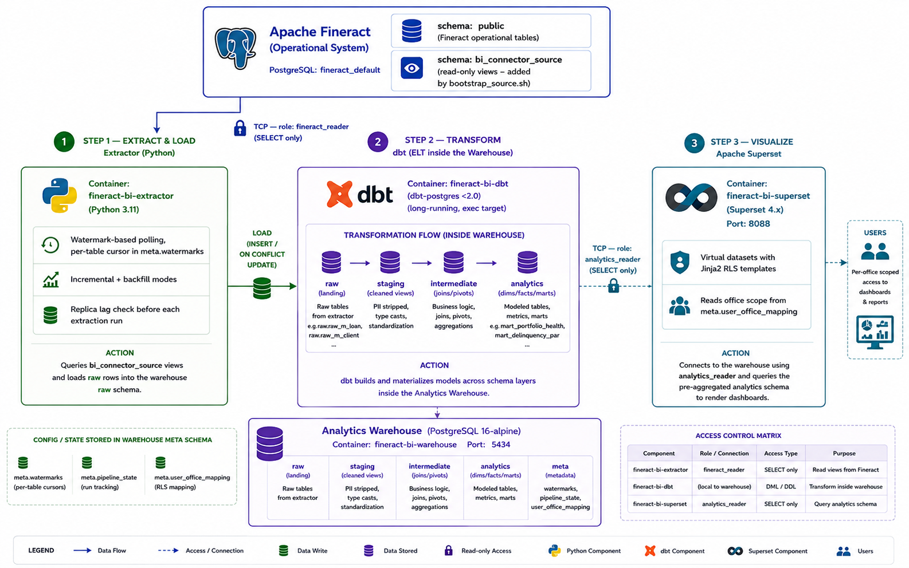
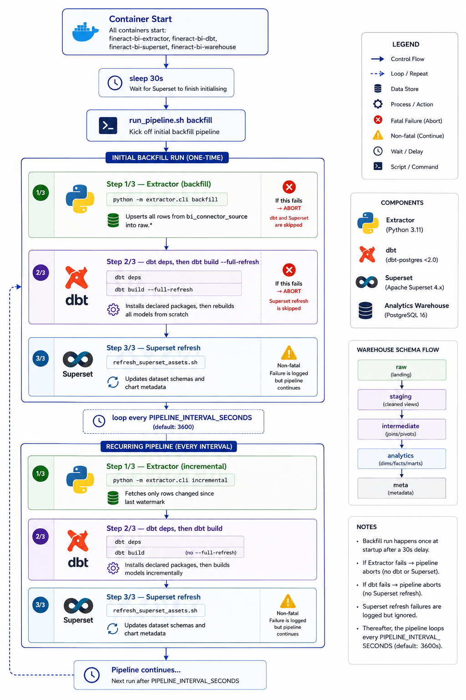

<!--
Licensed to the Apache Software Foundation (ASF) under one
or more contributor license agreements.  See the NOTICE file
distributed with this work for additional information
regarding copyright ownership.  The ASF licenses this file
to you under the Apache License, Version 2.0 (the
"License"); you may not use this file except in compliance
with the License.  You may obtain a copy of the License at

  http://www.apache.org/licenses/LICENSE-2.0

Unless required by applicable law or agreed to in writing,
software distributed under the License is distributed on an
"AS IS" BASIS, WITHOUT WARRANTIES OR CONDITIONS OF ANY
KIND, either express or implied.  See the License for the
specific language governing permissions and limitations
under the License.
-->

# Apache Fineract Business Intelligence — Architecture & System Design

This document describes the system topology, data flow, exact warehouse schema layers, data grain, security boundaries, and key design decisions. It does not contain installation or setup steps  see [README.md](../README.md) for those.


---

## 1. System Topology

Apache Fineract Business Intelligence is an **independent, downstream analytics system**. It connects to Fineract via a single read-only database connection. The BI stack joins the external `fineract_default` Docker network so the extractor container can reach the Fineract database container by name; no application-layer state or volumes are shared.

`bootstrap_source.sh` connects to the source container via `docker exec` and grants the `fineract_reader` role `SELECT` on both the `public` schema and the `bi_connector_source` compatibility schema.


---

## 2. Pipeline Execution Loop

The extractor container runs `scripts/run_pipeline.sh` in a loop. The shell script coordinates all three stages and enforces strict ordering. At the start of the dbt stage it runs `dbt deps`, so the declared packages are present even on a fresh checkout.



The pipeline log prefix is `[pipeline]` with a UTC timestamp:

```
[pipeline] 2026-08-11T16:00:00Z === Starting pipeline run (mode=incremental) ===
[pipeline] 2026-08-11T16:00:00Z Step 1/3 — Extractor (incremental)
[pipeline] 2026-08-11T16:00:05Z Step 1/3 — Extractor OK
[pipeline] 2026-08-11T16:00:05Z Step 2/3 — dbt (dbt build)
[pipeline] 2026-08-11T16:00:30Z Step 2/3 — dbt OK
[pipeline] 2026-08-11T16:00:30Z Step 3/3 — Superset asset refresh
[pipeline] 2026-08-11T16:00:32Z Step 3/3 — Superset OK
[pipeline] 2026-08-11T16:00:32Z === Pipeline run complete in 32s ===
```

---

## 3. Watermark-Based Incremental Extraction

To avoid full-table scans on every pipeline run, the extractor uses a **watermark table** in the warehouse to track the most recent row seen for each source table.

> This is watermark-based polling, not log-based CDC (e.g. WAL streaming or a Debezium-style connector). The extractor issues a `SELECT ... WHERE last_modified_on_utc > <watermark>` query against `bi_connector_source` on each run — it does not read the Postgres replication log. This is sufficient for Fineract's audit-column update pattern and needs no logical replication setup on the source, but it has one consequence worth knowing: **incremental mode never observes deletes.** A row removed at the source has no `last_modified_on_utc` to poll for, so it lingers in the warehouse until it is caught another way — see "Delete Detection" below.

### Delete Detection

The extractor also supports a `reconcile` mode (`python -m extractor.cli reconcile`) that diffs primary keys between source and warehouse and removes rows no longer present at the source. It is **not** invoked by `scripts/run_pipeline.sh`'s automatic incremental loop — the hourly pipeline run only extracts inserts/updates, so deleted source rows are not pruned from the warehouse until a `backfill` run (which resets and fully reloads each table, naturally dropping anything no longer at the source) or a manual `reconcile` invocation.

```
Fineract source (bi_connector_source.m_loan)
┌────┬────────┬─────────────────────────┐
│ id │ amount │ last_modified_on_utc    │
├────┼────────┼─────────────────────────┤
│ 10 │  5 000 │ 2026-08-11 09:00:00 UTC │  ← already extracted
│ 11 │  7 500 │ 2026-08-11 10:15:00 UTC │  ← new
│ 12 │  3 000 │ 2026-08-11 10:45:00 UTC │  ← new
└────┴────────┴─────────────────────────┘

meta.watermarks (in Analytics Warehouse)
┌──────────┬──────────────┬───────────────┬─────────────────────────┐
│ tenant_id│ table_name   │ cursor_column │ last_cursor_value       │
├──────────┼──────────────┼───────────────┼─────────────────────────┤
│ default  │ m_loan       │last_modified_ │ 2026-08-11 09:00:00 UTC │
│          │              │on_utc         │                         │
└──────────┴──────────────┴───────────────┴─────────────────────────┘

Query issued to source:
  WHERE last_modified_on_utc > '2026-08-11 08:50:00 UTC'
                            ↑
                  watermark − EXTRACT_LOOKBACK_SECONDS (600s)
                  Lookback compensates for clock skew and
                  in-flight transactions at the previous cut.

Extracted rows: ids 11, 12
  → raw.raw_m_loan: INSERT ... ON CONFLICT (id, tenant_id) DO UPDATE
```

### Extraction Properties

| Property | Value | Source |
|---|---|---|
| Cursor column | `last_modified_on_utc` (per-table, configured in extractor spec) | `extractor/extractor.py` |
| Lookback window | `EXTRACT_LOOKBACK_SECONDS` (default: 600 s) | `extractor/config.py` |
| Upsert conflict key | `(id, tenant_id)` | `extractor/extractor.py` |
| State table | `meta.watermarks` (tenant_id, table_name → last_cursor_value) | `warehouse/schema/pipeline_state.sql` |
| Replica lag guard | Aborts if source replication lag > `REPLICA_LAG_THRESHOLD_SECONDS` (default: 300 s) | `extractor/replica_lag.py` |
| Delete detection | Not automatic in incremental mode — see "Delete Detection" above | `extractor/cli.py` (`reconcile` mode) |

---

## 4. Analytics Warehouse Schema Layers

The warehouse (PostgreSQL 16) is a single database (`analytics`) partitioned into five schemas. Three are managed by dbt, one is the extractor landing zone, and one is the pipeline control plane.

```
PostgreSQL database: analytics
│
├── schema: raw          (managed by extractor)
│     raw.raw_m_loan
│     raw.raw_m_client
│     raw.raw_m_office
│     raw.raw_m_product_loan
│     raw.raw_m_loan_transaction
│     raw.raw_m_loan_repayment_schedule
│     raw.raw_m_loan_delinquency_tag_history
│     raw.raw_m_delinquency_range
│     raw.raw_m_delinquency_bucket
│     raw.raw_m_delinquency_bucket_mappings
│     raw.raw_batch_job_execution
│     Columns added by extractor: tenant_id, source_loaded_at
│
├── schema: raw_views    (managed by extractor — dbt source aliases)
│     Internal use only: lets dbt declare typed sources over raw tables.
│     Not accessible to analytics_reader.
│
├── schema: staging      (dbt — materialized as views)
│     staging.stg_m_loan
│     staging.stg_m_client     ← retains client_id, account_no, external_id
│                                 adds client_hash (MD5 pseudonym) and age_band
│     staging.stg_m_office
│     staging.stg_m_product_loan
│     staging.stg_m_loan_transaction
│     staging.stg_m_loan_repayment_schedule
│     staging.stg_m_delinquency (range, bucket, bucket_mappings, tag_history)
│     Role: column normalisation, type casting. NOT a PII-free zone — see §5.
│
├── schema: intermediate  (dbt — ephemeral, no physical tables)
│     Used for complex joins and pivots between staging and mart models.
│     Consumed only within the dbt DAG — never queried directly.
│
├── schema: analytics    (dbt — materialized as tables or incremental)
│   │
│   ├── Dimensions (materialized: table, rebuilt on each run)
│   │     analytics.dim_office
│   │     analytics.dim_client
│   │     analytics.dim_product
│   │     analytics.dim_currency
│   │     analytics.dim_date
│   │     analytics.dim_delinquency_bucket
│   │
│   ├── Facts (materialized: incremental, grain = one row per entity per day)
│   │     analytics.fact_loan_snapshot      grain: (loan_id, snapshot_date)
│   │                                        retains client_id and client_hash
│   │     analytics.fact_delinquency_event  grain: delinquency lifecycle event
│   │
│   └── Presentations / Marts
│         analytics.mart_portfolio_health   mat: table
│                                            grain: office × product × currency × date
│         analytics.mart_delinquency_par    mat: table
│                                            grain: office × product × bucket × date
│         analytics.mart_repayment_behavior mat: incremental
│                                            unique_key: (tenant_id, reporting_date,
│                                              office_id, product_id, currency_code,
│                                              client_hash)
│
└── schema: meta         (managed by warehouse init scripts)
      meta.watermarks          (per-table extraction cursor state)
      meta.pipeline_state      (run history — status, row counts)
      meta.user_office_mapping (username → office_id + role_name for RLS)
```

### Data Grain Reference

| Model | Grain | Materialization |
|---|---|---|
| `fact_loan_snapshot` | One row per `(loan_id, snapshot_date)` | Incremental |
| `fact_delinquency_event` | One row per delinquency tag lifecycle event | Incremental |
| `mart_portfolio_health` | One row per `(office_id, product_id, currency_code, snapshot_date)` | Table |
| `mart_delinquency_par` | One row per `(office_id, product_id, bucket, snapshot_date)` | Table |
| `mart_repayment_behavior` | One row per `(tenant_id, reporting_date, office_id, product_id, currency_code, client_hash)` — incremental, keyed by client hash not loan/installment | Incremental |

---

## 5. PII Handling & Data Anonymisation

PII reduction occurs at the **staging** layer only — staging is not fully PII-free. Several identifiers carry through into the analytics layer.

| Field | Transformation | Carried into analytics layer? |
|---|---|---|
| `date_of_birth` | Replaced with `age_band` (5 cohorts: `Unknown`, `18-24`, `25-34`, `35-44`, `45-54`, `55+`) in `stg_m_client` | No — original not exposed |
| `id` (client) | Added as `client_hash = MD5(tenant_id \|\| '::' \|\| id::text)` in `stg_m_client` | `client_hash` propagates; original `client_id` also propagates |
| `account_no`, `external_id` | Renamed in staging (`client_account_no`, `client_external_id`) but retained | Present in staging views |
| Loan fields | Not transformed — `client_id` is retained in `fact_loan_snapshot` | Yes — `client_id` present in fact table |
| Mart aggregations | `mart_portfolio_health` and `mart_delinquency_par` aggregate at office × product level — no individual rows | N/A |
| `mart_repayment_behavior` | Keyed at `(tenant_id, reporting_date, office_id, product_id, currency_code, client_hash)` — individual client represented via hash | `client_hash` present |

> **`client_hash` is pseudonymous, not anonymous.** `MD5(tenant_id || '::' || id::text)` is deterministic and unsalted. Given the client ID it is trivially reversible. It is a consistency key, not a privacy control.

> **Superset datasets** (`superset/datasets/*.sql`) use `analytics_reader` which does not have access to `raw_views` or `staging` schemas. Superset queries only `analytics.*` models and `meta.*` tables.

---

## 6. Row-Level Security Model

Row-level security is implemented as **Jinja2-templated virtual datasets** in Superset. Each dataset SQL file uses `current_username()` and looks up the user's office scope in `meta.user_office_mapping`.

```
Superset authenticates user → current_username() = 'north_manager'
         │
         ▼
Dataset SQL (e.g. portfolio_health_secure_latest.sql):
─────────────────────────────────────────────────

select *
from analytics.mart_portfolio_health
where snapshot_date = (select max(snapshot_date) from analytics.mart_portfolio_health)
and (
    '{{ username }}' != ''
    and (
        exists (
            select 1 from meta.user_office_mapping uom
            where uom.username = '{{ username }}' and uom.role_name = 'ADMIN'
        )
        or office_id in (
            select office_id from meta.user_office_mapping
            where username = '{{ username }}' and office_id is not null
        )
    )
)
─────────────────────────────────────────────────
         │
         ├─ ADMIN role (office_id IS NULL in mapping) → sees all offices
         └─ BRANCH_MANAGER role → sees only their office_id rows
```

### RLS Lookup Table (populated at warehouse init)

```
meta.user_office_mapping
┌────────────────┬───────────┬──────────────────┐
│ username       │ office_id │ role_name        │
├────────────────┼───────────┼──────────────────┤
│ admin          │ NULL      │ ADMIN            │
│ north_manager  │ 101       │ BRANCH_MANAGER   │
│ south_manager  │ 102       │ BRANCH_MANAGER   │
└────────────────┴───────────┴──────────────────┘
```

---

## 7. Container Specifications

| Container | Image | Role | Ports |
|---|---|---|---|
| `fineract-bi-warehouse` | `postgres:16-alpine` | Analytics PostgreSQL warehouse | host `5434` → container `5432` |
| `fineract-bi-extractor` | Custom (Python 3.11) | Watermark extraction controller + loop runner | internal only |
| `fineract-bi-dbt` | Custom (dbt-postgres <2.0) | SQL transformation model runner (exec target) | internal only |
| `fineract-bi-superset` | Custom (Apache Superset 4.x) | Dashboard UI + RLS enforcement | host `8088` → container `8088` |

The extractor container mounts `/var/run/docker.sock` to issue `docker compose exec` commands that trigger dbt builds and Superset refreshes as part of the pipeline loop.

---


